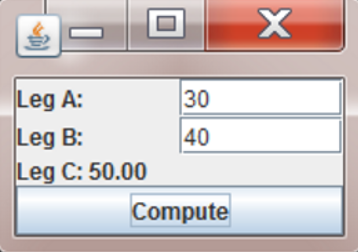

> **NOTE:** This README.md file should be placed at the **root of each of your repos directories.**
>
>Also, this file **must** use Markdown syntax, and provide project documentation as per below--otherwise, points **will** be deducted.
>

# Lis4331

## Roman Avdei

### Assignment # Requirements:

*Sub-Heading:*

1. Creation of music application
2. Skillsets 7-9
3. Addition of scrolling functionality

#### README.md file should include the following items:

* Music application splash screen
* Screenchots of skillsets 7-9
* Screenshots showcasing playing music
* Music application opening and pause scrren

> This is a blockquote.
> 
> This is the second paragraph in the blockquote.
>

#### Assignment Screenshots:

*Screenshots of Music app:
.png>)
.png>)
.png>)
.png>)

*Screenshot of skill sets:
.png>)

.png>)
#### Tutorial Links:

*Bitbucket Tutorial - Station Locations:*
[A1 Bitbucket Station Locations Tutorial Link](https://bitbucket.org/username/bitbucketstationlocations/ "Bitbucket Station Locations")

*Tutorial: Request to update a teammate's repository:*
[A1 My Team Quotes Tutorial Link](https://bitbucket.org/username/myteamquotes/ "My Team Quotes Tutorial")
